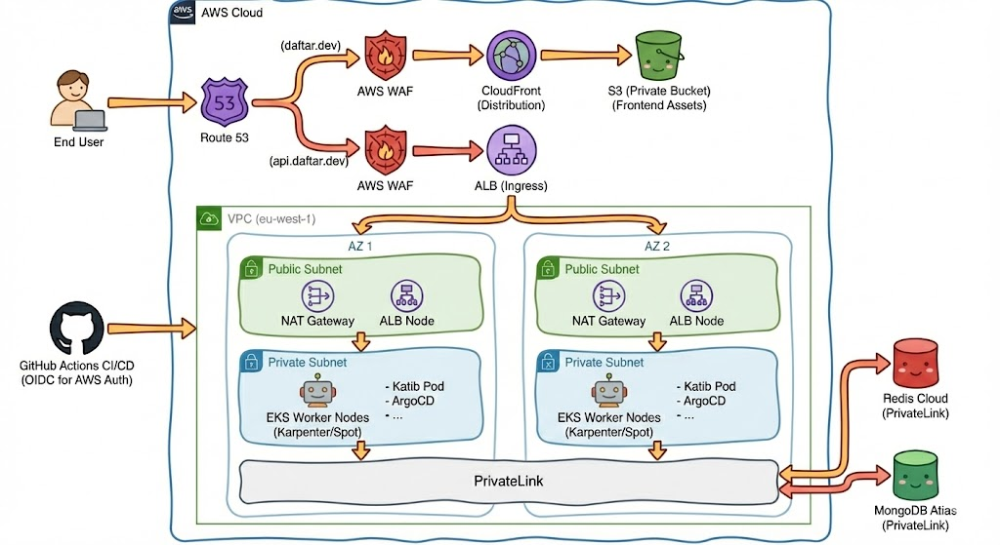

# Waraq Project: Architecture and Design

This document outlines the architecture of the Waraq project, detailing both the current local simulation and the ideal production architecture on AWS. The local setup is designed to replicate the core functionalities of a cloud environment while minimizing costs, using tools like LocalStack, k3s, and free tiers of managed services.

The primary goal is to demonstrate a clear understanding of production-ready DevOps principles, including security, scalability, high availability, and cost optimization, which would be applied in a real-world AWS deployment.

## 1. Current Architecture (Local Simulation)

The current setup simulates the cloud environment on a local machine. It uses `k3s` for a lightweight Kubernetes cluster and `LocalStack` to emulate AWS services. External services like MongoDB Atlas and Redis Cloud are accessed via their public endpoints.

### 1.1. Architecture Diagram (Local)

```text
                               +-------------------------------------------------+
                               |                Developer Machine                |
                               |                                                 |
+----------------------+       |  +-----------------+      +-------------------+ |       +---------------------+
|      Developer       | ----> |  |   Browser       |      |      kubectl      | | ----> |  MongoDB Atlas      |
+----------------------+       |  | (api.daftar.dev)|      |       (CLI)       | |       | (Public Endpoint)   |
                               |  +-------+---------+      +---------+---------+ |       +---------------------+
                               |          |                          |           |
                               |  +-------v--------------------------v---------+ |       +---------------------+
                               |  | k3s Cluster (localhost)                    | | ----> |   Redis Cloud       |
                               |  |                                            | |       | (Public Endpoint)   |
                               |  | +------------------+   +-----------------+ | |       +---------------------+
                               |  | | Traefik Ingress  |-->| Katib Service   | | |
                               |  | | (api.daftar.dev) |   | (Go Backend)    | | |
                               |  | +------------------+   +-------+---------+ | |
                               |  |                                |           | |
                               |  | +------------------------------v---------+ | |
                               |  | | ArgoCD -> GitOps from GitHub           | | |
                               |  | +----------------------------------------+ | |
                               |  +--------------------------------------------+ |
                               |                                                 |
                               |  +--------------------------------------------+ |
- - - - - - - - - - - - - - - -| -- LocalStack (Docker) ---------------------- | - - - - - - - - - - - - - - - -
                               |  |                                            | |
                               |  |  +------------------+   +----------------+ | |
                               |  |  | S3 (Public)      |<--| Hugo Build     | | |
                               |  |  | (daftar.dev...)  |   | (Manual Sync)  | | |
                               |  |  +------------------+   +----------------+ | |
                               |  |                                            | |
                               |  |  +------------------+                      | |
                               |  |  | Secrets Manager  |                      | |
                               |  |  | (Simulated)      |                      | |
                               |  |  +------------------+                      | |
                               |  +--------------------------------------------+ |
                               +-------------------------------------------------+
```

### 1.2. Key Characteristics & Limitations

* **Frontend Hosting**: The `Daftar` frontend is hosted on a **public S3 bucket** managed by LocalStack. This is a deviation from best practices, necessitated by the lack of CloudFront support in the free tier of LocalStack.
* **Backend Services**: The `Katib` backend runs in a local `k3s` cluster.
* **Database & Cache**: MongoDB Atlas and Redis Cloud are accessed over the internet via **public endpoints**. This is suitable for local development but not secure for production.
* **Secrets**: Kubernetes secrets for `Katib` are populated from a simulated AWS Secrets Manager (a `vault` namespace in k3s) using the External Secrets Operator as it doesn't support fetching from localstack(or I haven't figured it out).
* **Deployment**: Infrastructure is managed by Terraform, and applications are deployed via ArgoCD using a GitOps workflow. The frontend is deployed manually via a terraform resource that uploads files to the S3 bucket.
* **Cost Efficiency**: This local setup incurs minimal costs, primarily limited to the usage of MongoDB Atlas and Redis Cloud free tiers.

## 2. Ideal Production Architecture (AWS)

This architecture represents a secure, scalable, and highly available setup for the Waraq project on AWS. It adheres to the AWS Well-Architected Framework principles.

### 2.1. Architecture Diagram (Production)



> generated with the help of Google's [gemini nano banana pro](https://gemini.google/overview/image-generation/)

## 3. Bridging the Gap: From Local to Production

This section details the key architectural improvements and considerations required to move from the local simulation to the ideal production environment.

### 3.1. Security

* **Network Security**:
  * **Private Endpoints**: All external services, including **MongoDB Atlas and Redis Cloud**, will be connected via **AWS PrivateLink**. This ensures that data does not traverse the public internet.
  * **WAF & Shield**: An **AWS WAF** will be placed in front of both CloudFront and Load balancer to protect against common web exploits (e.g., SQL injection, XSS). AWS Shield Advanced would be used for DDoS protection.
  * **Kubernetes Network Policies**: Strict network policies will be enforced within the EKS cluster to control traffic flow between pods, allowing only necessary communication (e.g., only the ingress controller can talk to the `Katib` service).
* **Identity and Access Management (IAM)**:
  * **IAM Roles for Service Accounts (IRSA) / Pod Identity**: Instead of using long-lived access keys, pods running on EKS will use **IRSA** to assume IAM roles with fine-grained permissions to access other AWS services (e.g., Secrets Manager).
  * **CI/CD Authentication**: The GitHub Actions pipeline will use **OIDC** to securely authenticate with AWS and assume a deployment role, eliminating the need to store static `AWS_ACCESS_KEY_ID` and `AWS_SECRET_ACCESS_KEY` as GitHub secrets.
  * **EKS Access Entries**: EKS access will be managed centrally through **EKS Access Entries**, simplifying permissions management for IAM principals.
* **Frontend Hosting**:
  * **Private S3 Bucket**: The S3 bucket hosting the `Daftar` frontend will be **private**.
  * **CloudFront with OAI/OAC**: **Amazon CloudFront** will serve the content, using an Origin Access Identity (OAI) or Origin Access Control (OAC) to securely access the private S3 bucket.

### 3.2. Scalability & High Availability

* **Compute**:
  * **EKS with Karpenter**: The cluster will use **Amazon EKS** for a managed Kubernetes control plane. **Karpenter** will be used for node auto-scaling, allowing the cluster to efficiently provision right-sized nodes (including **Spot Instances**) based on pod requirements, which is highly cost-effective.
  * **Horizontal Pod Autoscaler (HPA)**: The `Katib` deployment will be configured with an HPA to automatically scale the number of pods based on CPU and memory utilization.
* **High Availability (HA)**:
  * **Multi-AZ Deployment**: The entire infrastructure, including EKS worker nodes and NAT Gateways, will be deployed across multiple Availability Zones (AZs) to ensure resilience against an AZ failure.
  * **Database/Cache**: MongoDB Atlas and Redis Cloud will be configured with multi-AZ replication.
* **Disaster Recovery (DR)**:
  * **Infrastructure as Code (IaC)**: The entire infrastructure is defined in **Terraform**. In a disaster scenario, the environment can be quickly and reliably recreated in a different region.
  * **State Locking**: The Terraform S3 backend is configured with `use_lockfile = true` and bucket versioning, which prevents concurrent state modifications and allows for state recovery. In production, DynamoDB would be used for more robust state locking.

### 3.3. Deployment & CI/CD

* **Frontend Deployment**:
  * The CI/CD pipeline for the `Daftar` frontend will be automated. On a merge to the `main` branch, the pipeline will:
    1. Build the Hugo site (`hugo --gc --minify`).
    2. Sync the `public/` directory to the private S3 bucket.
    3. Trigger a **CloudFront cache invalidation** for `/*` to ensure users receive the latest version of the site immediately.
* **Backend Deployment**: The existing GitOps workflow with ArgoCD remains valid. The GitHub Actions pipeline builds and pushes the `Katib` Docker image, and ArgoCD detects the new image tag and automatically syncs the deployment in the EKS cluster.

### 3.4. Cost Optimization

* **Compute**: Using **Karpenter with Spot Instances** for EKS worker nodes can reduce compute costs by up to 90% compared to On-Demand instances for stateless workloads.
* **Data Transfer**: Using **VPC Private Endpoints** and keeping traffic within the AWS network minimizes data transfer costs.
* **CDN**: **CloudFront** caches content at edge locations, reducing the number of requests to the S3 origin and lowering data transfer out costs.
* **Right-Sizing**: The resource requests and limits for Kubernetes deployments are defined and would be continuously monitored and adjusted to ensure optimal resource utilization.
